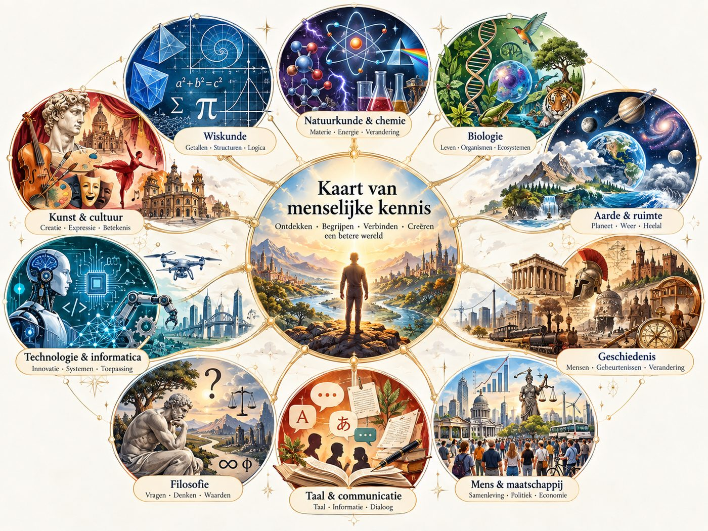

# Rekenen & Wiskunde door de Eeuwen

Een lokaal draaiende, interactieve leeromgeving die rekenen en wiskunde vanaf
het absolute basisniveau opnieuw opbouwt tot statistiek op HBO/WO-niveau — met
de geschiedenis van het wiskundige denken als leidraad. Gebouwd volgens
`build_plan.docx`.

**Kern:** begrijpen → toepassen → fouten maken → uitleg krijgen → opnieuw proberen → beheersen.

## Stand van zaken

| Onderdeel | Inhoud | Diepgang |
|---|---|---|
| Deel I – Fundamenten (modules 1–6) | 43 lessen, 216 oefeningen, 90 toetsvragen | uitgebreid |
| Deel II – Basisschool bovenbouw (modules 7–12) | 47 lessen, 186 oefeningen, 90 toetsvragen | compact |
| Deel III – VMBO / basis middelbaar (modules 13–18) | 48 lessen, 180 oefeningen, 90 toetsvragen | compact |
| Deel IV – HAVO (modules 19–24) | 48 lessen, 180 oefeningen, 90 toetsvragen | compact |
| Deel V – VWO (modules 25–30) | 48 lessen, 208 oefeningen, 90 toetsvragen | uitgebreid: 28–30; compact: 25–27 |
| Deel VI – Toegepaste wiskunde (modules 31–35) | 40 lessen, 190 oefeningen, 75 toetsvragen | uitgebreid |
| Deel VII – HBO/WO statistiek (modules 36–42) | 49 lessen, 140 oefeningen, 105 toetsvragen | compact |
| Historische tijdlijn | 60 gebeurtenissen | |
| Wiskundigenbibliotheek | 23 profielen | |
| Oefenengine | numeric, decimal, fraction, expression, coordinate, interval, multiple, text (+ foutenanalyse) | |
| Voortgang, beheersing, spaced repetition | werkend | |

Alle 42 modules zijn beschikbaar: samen 323 lessen, 1.300 oefeningen en 630
toetsvragen. *Uitgebreid* betekent het volle niveau uit het bouwplan (ca. tien
boekpagina's per module, veel uitgewerkte voorbeelden en foutenanalyse);
*compact* modules zijn inhoudelijk correct en volledig bruikbaar, maar worden
nog uitgebreid tot dat niveau. Open interpretatievragen worden opgeslagen voor vergelijking met
modelantwoorden; ze tellen niet mee voor automatische beheersing. Het
eindonderzoek bevat een echte lokale dataset, een uitgewerkt onderzoek en een
rubric voor zelfbeoordeling van je eigen rapport.

## Installatie

Vereist: PHP 8.3+, Composer, Node 20+.

```bash
composer install
cp .env.example .env        # DB_CONNECTION=sqlite staat al goed
php artisan key:generate
php artisan migrate
npm install
npm run build
php artisan serve           # http://127.0.0.1:8000
```

Tijdens ontwikkelen in een tweede terminal `npm run dev` voor live herladen.

### Starten met een dubbelklik (Windows)

Na de installatie kun je dubbelklikken op [`start.bat`](start.bat). Het bestand
bouwt de vormgeving en scripts, start de lokale server en opent de applicatie
automatisch in je browser. Het kiest de eerste vrije poort vanaf 8000 (tot en
met 8099). Als poort 8000 bezet is, opent het bijvoorbeeld
<http://127.0.0.1:8001>. Het gekozen adres staat ook in het servervenster.
Laat het servervenster open zolang je de applicatie gebruikt; sluit het om de
server te stoppen. Je kunt ook een snelkoppeling naar `start.bat` op je
bureaublad zetten.

> De ingebouwde PHP-server verwerkt op Windows één verzoek tegelijk. Voor
> dagelijks gebruik is dat prima; bij heel snel klikken kan een pagina even
> blijven hangen. Herstart dan `php artisan serve`.

## Architectuur

Content en applicatielogica zijn volledig gescheiden (bouwplan §4):

- **Laag A – content** (`content/`): Markdown en JSON. Zie
  [`docs/CONTENT_GUIDE.md`](docs/CONTENT_GUIDE.md) voor het exacte formaat en
  [`docs/HISTORY_IDS.md`](docs/HISTORY_IDS.md) voor de tijdlijn-id's.
- **Laag B – applicatie** (`app/`, `resources/`, `routes/`): Laravel leest en
  presenteert de content.
- **Laag C – gebruikersgegevens** (SQLite): alleen pogingen, voortgang,
  beheersing en instellingen.

```
ContentService ──► LessonRenderer / MarkdownRenderer ──► lessen, kaders, KaTeX, widgets
       │
       ▼
ExerciseService ──► AnswerCheckerFactory ──► zeven checkers, inclusief meerdere invoervelden
       │
       ├──► exercise_attempts
       ├──► MasteryService (topic_mastery: +3 goed, +1 met hint, −5 fout)
       └──► ProgressService (module_progress: afgerond ≥ 70%, beheerst ≥ 85%)
                    │
                    ▼
             ReviewService (60% zwak · 25% normaal · 15% oude stof)
```

Instelbare regels (drempels, beheersingspunten, herhalingsintervallen) staan in
[`config/course.php`](config/course.php).

## Content toevoegen

1. Vul `content/modules/NN-slug/module.json` aan en zet `status` op `available`.
2. Schrijf de lessen in Markdown (kaders `:::history`, formules `$…$`,
   directieven `{{ exercise: NN-001 }}`, `{{ widget: … }}`).
3. Zet oefeningen in `exercises.json` en de toets in `quiz.json`.
4. Controleer met:

```bash
php artisan content:validate
```

## Tests

```bash
php artisan test
```

Voor de interactieve visualisaties (PowerShell):

```powershell
$javascriptTests = @(Get-ChildItem tests/JavaScript -Filter '*.test.mjs' | ForEach-Object { $_.FullName })
node --test @javascriptTests
```

Voor de referentieanalyse van het eindonderzoek (optioneel, Python 3):

```text
python tests/Python/research_analysis_test.py
python content/modules/42-eindonderzoek/analyse.py
```

De analyse gebruikt alleen de Python-standaardbibliotheek en leest de bestaande
CSV. De datasetbron, CC0-licentie, jaarselectie en vertaalde kolommen zijn
vastgelegd in `content/modules/42-eindonderzoek/dataset.json`.

De engine-tests draaien op een kleine vaste testcursus (`tests/Fixtures/content`);
`ContentIntegrityTest` valideert de echte content.

## Routes

`/` dashboard · `/course` cursusoverzicht · `/course/{module}` · `/course/{module}/lesson/{les}` ·
`/course/{module}/quiz` · `/practice` · `/review` · `/progress` · `/history` ·
`/mathematicians` · `/glossary` · `/formulas` · `/search` · `/settings`

## Bewust niet in versie 1

Accounts, cloud, AI-tutor, badges, rankings, CMS, docentomgeving en API
(bouwplan §47). De database is zo opgezet dat later een `user_id` kan worden
toegevoegd.

## Toekomst: meer kennisdomeinen

Deze cursus is het eerste domein van een bredere kaart van menselijke kennis.
Later moet je kunnen navigeren tussen wiskunde en andere domeinen, zoals
natuurkunde en scheikunde, biologie, aarde en ruimte, geschiedenis, filosofie,
taal, technologie, kunst en maatschappij. De architectuur (content los van de
applicatie) is daarop voorbereid: een domein is in principe een eigen
`content/`-map met dezelfde structuur.


